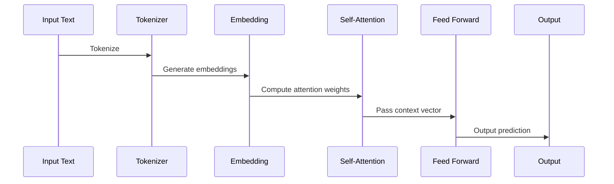

# 🧠 transformer-c

A foundational **Transformer neural network implemented purely in C**, built for transparency, learning, and performance.  
This project reconstructs the architecture of modern attention-based models (like GPT and BERT) from scratch —  
revealing every computational step under the hood of deep learning.

---

## 🚀 Overview
`transformer-c` is a **minimal, educational, and modular implementation** of a Transformer neural network,  
written entirely in **C** to expose the true mechanics of sequence modeling and attention.

It demonstrates:
- Modular, low-level implementations of every Transformer subsystem  
- Self-attention, feed-forward layers, normalization, and backpropagation  
- Step-by-step numerical transparency for debugging or embedded experimentation  
- Extensible design for OpenCL/Vulkan compute or hardware-level deployment  

---

## 🧩 Architecture (Mermaid Diagram)
```mermaid
graph TD
  A[Input Text] -->|Tokenize| B[Tokenizer.c]
  B --> C[Embedding + Positional Encoding]
  C --> D[Self-Attention Layer]
  D --> E[Feed Forward Layer]
  E --> F[Output]
````

---

## ⚙️ Build

```bash
gcc -O2 -Wall -Wextra -fopenmp \
    main.c activation_functions.c backpropagation.c Data_Loading_Cleaning.c \
    Data_Preprocessing.c feed_forward_layer.c Tokenizer.c transformer_block.c \
    self_attention_layer.c -lm -o transformer_main
./transformer_main
```

---

## 🧠 Math Overview

[
Attention(Q,K,V)=softmax(\frac{QK^T}{\sqrt{d_k}})V
]

[
FFN(x)=max(0,xW_1+b_1)W_2+b_2
]

[
PE(pos,2i)=sin(\frac{pos}{10000^{2i/d_{model}}}),\quad
PE(pos,2i+1)=cos(\frac{pos}{10000^{2i/d_{model}}})
]

---

## 🧩 Sequence Flow (Mermaid)



---

## 🧾 License

MIT License © 2025 **PStudios Automate**

Made with ❤️ by PStudios Automate
